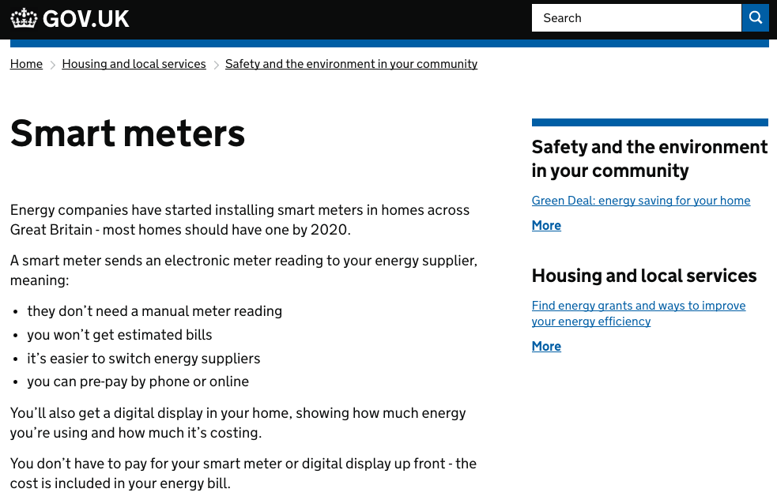
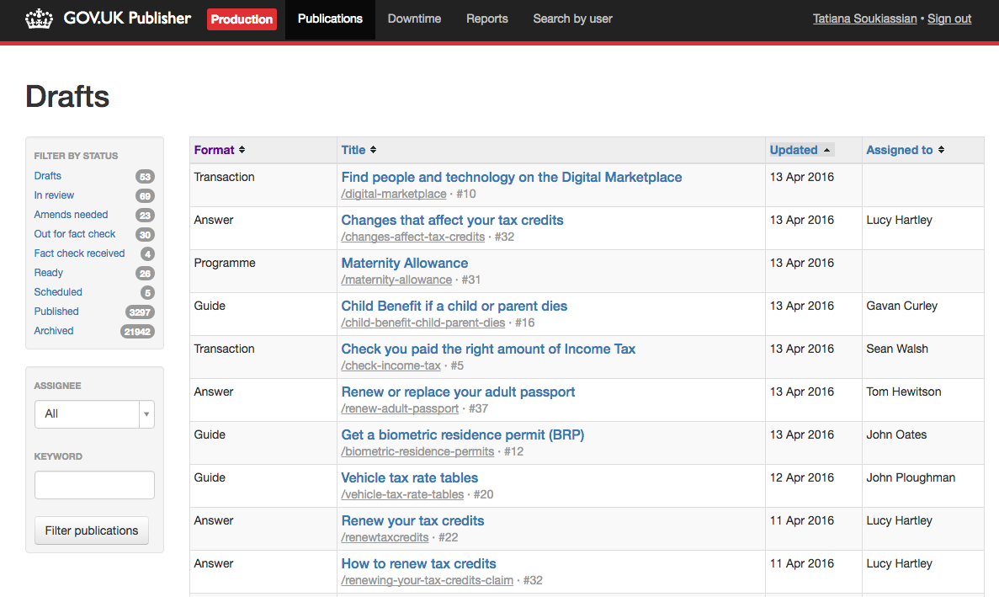

# Publisher

Publisher is the primary content design app for GOV.UK. It provides the user interface for
entering all the key editorial formats and an API so other apps (primarily frontend) can
access that data for display. It is intended to work in partnership with Panopticon which
manages document creation, metadata, slugs, titles, etc. It is sometimes referred to as "mainstream publisher".

##Screenshots




## Live examples
- [Answer](https://www.gov.uk/smart-meters)
- [Business support](https://www.gov.uk/waterborne-freight-grant-wfg-scotland)
- [Campaign](https://www.gov.uk/mystatepension)
- [Completed transaction](https://www.gov.uk/done/make-lpa)
- [Guide](https://www.gov.uk/council-tax-appeals)
- [Help page](https://www.gov.uk/help/accessibility)
- [Licence](https://www.gov.uk/day-nurseries-wales)
- [Local transactions](https://www.gov.uk/complain-about-your-council)
- [Place](https://www.gov.uk/ukonline-centre-internet-access-computer-training)
- [Programme](https://www.gov.uk/home-responsibilities-protection-hrp)
- [Simple smart answer](https://www.gov.uk/qualify-tax-credits)
- [Transaction](https://www.gov.uk/council-tax-bands)
- [Video](https://www.gov.uk/renting-buying-business-premises)

## Nomenclature

- Artefact: a document on GOV.UK. Artefacts shown in publisher were created in the [panopticon](https://github.com/alphagov/panopticon) app.

## Technical documentation

This is a Ruby on Rails application that publishes the content for mainstream document formats to the shared mongo database. It manages content created in [panopticon](https://github.com/alphagov/panopticon). The `frontend` app reads this content from the [govuk_content_api](https://github.com/alphagov/govuk_content_api).

###Dependencies

- [panopticon](https://github.com/alphagov/panopticon) - manages creation and tagging of artefacts/documents listed in publisher. It is being deprecated.
- [imminence](https://github.com/alphagov/imminence) - provides geographical search tools
- [rummager](https://github.com/alphagov/rummager) - search index for publisher. All changes are also sent to rummager to be indexed
- [content-store](https://github.com/alphagov/content-store) - new central storage of published content on GOV.UK
- [govuk_content_api](https://github.com/alphagov/govuk_content_api) - API providing content and metadata to frontend apps. Being deprecated in favour of content-store.
- [publishing-api](https://github.com/alphagov/publishing-api) - will provide workflow for all content published to GOV.UK - creating a new document, publishing it, etc. Content published here will end up in the content-store
- [router-api](https://github.com/alphagov/router-api) - API for updating the [GOV.UK Router](https://github.com/alphagov/router.git)
- [govuk-content-schemas](http://github.com/alphagov/govuk-content-schemas) - defines the schemas for new-style document formats. Required to run the tests.

```shell
bundle exec rake local_transactions:import SOURCE=/path/to/local_authority_service_details.CSV
```

- [statsd](https://github.com/etsy/statsd/) - this application uses [statsd-ruby](http://rubygems.org/gems/statsd-ruby) to send metrics to statsd. If a statsd process isn't present on the server it won't matter as statsd-ruby sends metrics over UDP. If a statsd process is present then
it'll send strings with the respective increment/decrement/gauge function to use.
- [asset-manager](https://github.com/alphagov/asset-manager) - manages uploaded assets (images, PDFs, videos etc.). Publisher needs an OAuth bearer token in order to authenticate with Asset Manager. By default, this is loaded from the `PUBLISHER_ASSET_MANAGER_BEARER_TOKEN` environment variable in `config/initializers/gds_api.rb`, which is automatically provided if using the development VM.
Otherwise, to obtain this bearer token you should create an API user in the signonotron2 application. In the signonotron2 directory, to generate the bearer token you need, run:

```shell
rake api_clients:create[publisher,publisher@example.com,asset-manager,signin]
```
### Running the application

If you're just interested in running the Publisher locally, with a minimum of interaction
with other apps, here's how. This assumes you're using this [development setup](https://github.gds/gds/development).

```shell
cd /var/govuk/development
bowl publisher
```

### Running the test suite

`bundle exec rake`

The test suite relies on the presence of the [govuk-content-schemas](http://github.com/alphagov/govuk-content-schemas)
repository. If should be at the same directory level as the government-frontend repository.

Or to specify the location explicitly:

`GOVUK_CONTENT_SCHEMAS_PATH=/some/dir/govuk-content-schemas bundle exec rake`

## Licence

[MIT License](LICENSE)
